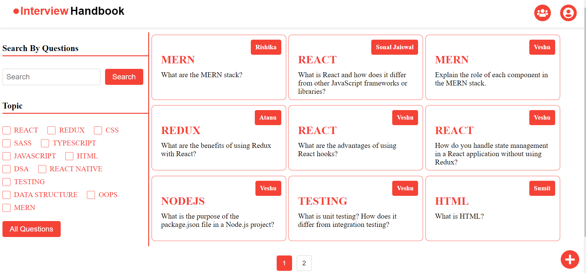
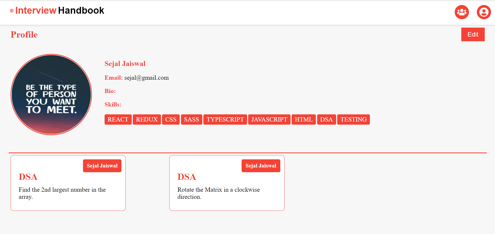
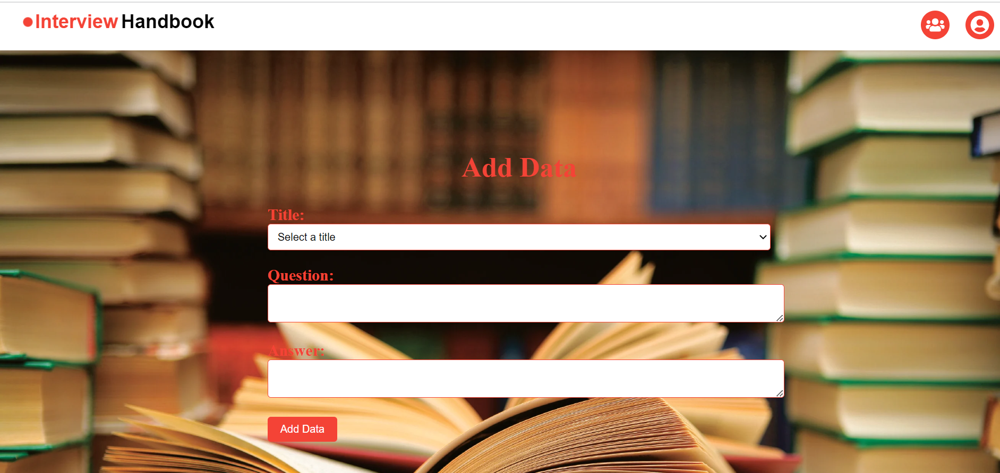
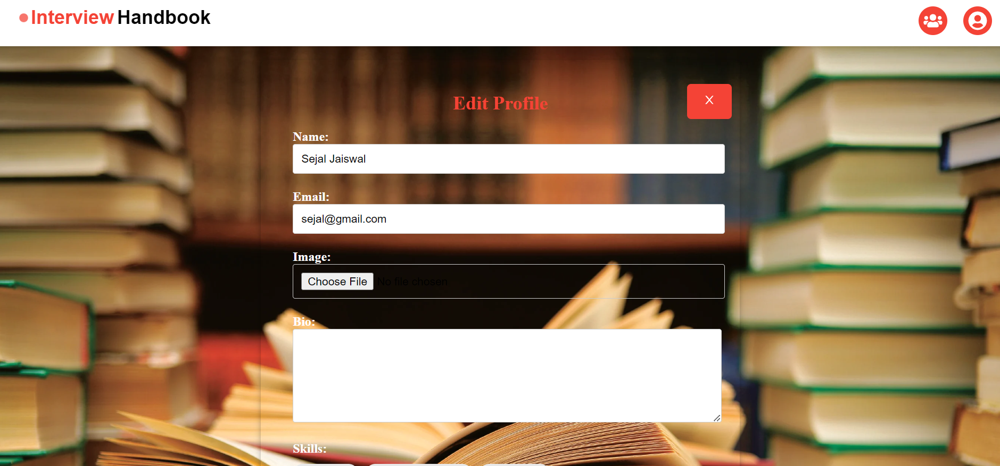
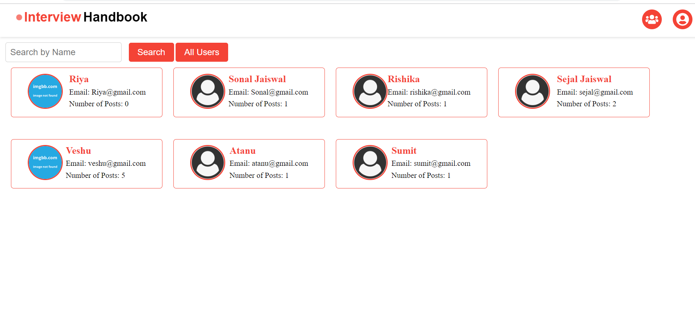

# InterviewBook

The InterviewBook Project is a web application designed to help users prepare for job interviews by providing a platform to create, organize, and practice interview questions. The project aims to assist job seekers in improving their interview performance and boosting their confidence.

## Frontend

### Features
- User Registration and Authentication: Allow users to create accounts and securely log in to the application.
- Question Management: Enable users to add the question
- Question Bank: Provide a comprehensive bank of interview questions.
- Question Search: Allow users to search for specific interview questions using question name.
- Profile: User able to create there profile.
- User Profile: Allow users to view and update their profiles, including personal information and preferences.
- 
### Getting Started
#### Prerequisites
- Node.js and npm should be installed on your machine. You can download them from the official Node.js website.
#### Installation
1. Clone the repository:

   ```shell
   git clone https://github.com/your-username/your-project.git
   
2. Install dependencies:
  
   ```shell
   npm install
   
3. Starting the Development Server
To start the development server, run the following command:

   ```shell
   npm start
  
#### Accessing the Application
Once the development server is running, you can access the application by navigating to http://localhost:3000 in your web browser.  

#### Usage
- Register
    
- Login
    
- Home Page
    
- Profile
    
- Add Questions
     
- Update Profile
     
- See Your Friend Account
    

#### Folder Structure
- /InterviewBook
  - /Frontend
     - /public
     - /src
        - /Components
          - AddData.jsx
          - Data.jsx
          - EditProfile.jsx
          - Loading.jsx
          - Logo.jsx
          - Navbar.jsx
          - Footer.jsx
        - /Pages
           - Add.jsx
           - Friend.jsx
           - Home.jsx
           - Login.jsx
           - Profile.jsx
           - QAnswer.jsx
           - Register.jsx
        - /Route
          - AllRouter.jsx
        - /Sass
          - Add.scss
          - AddData.scss
          - Data.scss
          - EditProfile.scss
          - Friend.scss
          - Footer.scss
          - Home.scss
          - Loading.scss
          - Login.scss
          - Logo.scss
          - Navbar.scss
          - Profile.scss
          - QAnswer.scss
        - App.js
        - App.test.js
        - index.js
        - index.scss
        - reportWebVitals.js
        - setupTests.js
     - .gitignore
     - Readme.md
     - package.json
  - /Backend
    - /model
      - post.model.js
      - user.model.js
    - /routes
      - post.routes.js
      - user.routes.js
    - .gitignore
    - db.js
    - index.js
    - package-lock.json
    - package.json
  - /Readme.md
  - /Images


## Backend
| HTTP Method | Route               | Description                   |
|-------------|---------------------|-------------------------------|
| POST        | /register           | Registration                  |
| POST        | /login              | Login                         |
| GET         | /users              | Get all the users             |
| Get         | /:id                | Get user by id                |
| PATCH       | /:id                | Update user information by id |
| POST        | /post               | Post the data                 |
| GET         | /post/data          | Get the data                  |
| GET         | /post/postId        | Get data by id                |
| PATCH       | /post/postId        | Update a data by ID           |
| DELETE      | /post/postId        | Delete a data by ID           |

### Contact

If you have any questions, suggestions, or feedback, feel free to reach out to the project maintainer or team:

- **Project Maintainer:** [Sejal Jaiswal](mailto:710sejal@gmail.com)
- **Project Repository:** [GitHub](https://github.com/sejal710/InterviewBook)

You can also chat for further discussions and support:

- **Communication Chat:** [Linkdien](https://www.linkedin.com/in/sejal-jaiswal-645b4b217/)
